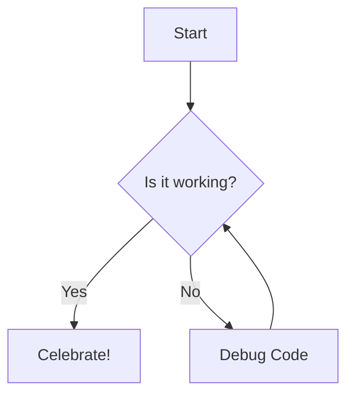

# Music Practice Timer — Specification

## Concept

A Progressive Web App (PWA) designed for musicians to encourage structured micro-breaks during practice. Modeled on HIIT-style interval training: short focused work bursts alternating with brief mental resets (micro-breaks), grouped into larger timed blocks.

-----

## Intended deployment environment
Optimize for an iPhone or iPhone mini. Use UI techniques that will work reliabily in Safari on an iPhone. Use WebKit-compatible patterns. Ensure that the iPhone status bar color matches the color of the app. 

Try to make it look "native" on the iPhone. For example, you might need to do something like is shown in the code block, below. If the app is displaying "under" the status bar, ensure that we don't try to show actual content under the status bar.
```code
<meta name="apple-mobile-web-app-status-bar-style" content="black-translucent">
```
-----

## Timer Structure

### Micro Cycle (inner loop)

- **Practice phase** — active playing/work. AKA "work"
- **Micro-break phase** — brief mental rest; brain consolidates recent practice. AKA "break"
- Cycles repeat automatically until the macro block is done
- The length of a block is specified in cycles, but also show the user the duration in minutes and seconds.


### Macro Cycle (outer loop)

- A timed block containing many micro cycles
- When the block expires, play a small "success fanfare" and then begin a **Long Rest** AKA "rest"
- After the long rest, play an "alarm" evocative of "back to work"
- A "start" button is visible during the long rest phase. Pressing it will start the block. It appears where the "audio player" controls appear during other phases (see below).
- When the app first loads, it essentially starts in the "long rest" phase, as if the "back to work" alarm had already played.
- When in the "back to work" phase, hide the countdown timer. In its place, display "Ready?"


-----

## Default Durations (all adjustable in Settings)

|Timer         |Default|Range    |
|--------------|-------|---------|
|Practice phase|45 sec |15–120 sec|
|Micro-break   |15 sec |10–60 sec |
|Block length  |5 cycles |3–15 cycles |
|Long rest     |2 min|1–5 min|

-----

## Controls

The main controls look like audio-player controls
- A "next track" button skips to the next phase (work → break → work, or rest when you reach the end of the last work phase in the block)
- A "Play/Pause" button — freezes all timers
- A "Previous track" button restarts the current phase

A **Settings button** is in the lower right. It opens the settings panel; pauses timer while open

Listen for keyboard input: "Space bar" will play/pause. "Enter" acts like "next track" (play/pause)

-----

## Visual Design

Instead of "Micro-break" display "[greek symbol mu]break" in the UI

- Full-screen color themes per phase:
  - **Practice** — warm rusty deep orange
  - **Micro-break** — deep blue/indigo
  - **Long rest** — black
- Circular countdown ring for the timer during work, break, and rest. Either use a CSS-based approach or, if you use a SVG approach, ensure that SVG values are mathematically precise and declared inline rather than via stylesheet. The same applies to the "block cycle progress bar", discussed next.
- Progress bar near the top of the screen for macro block, in terms of time
- Block cycle counter (e.g. “2 of 5”)


Make fonts large enough for easy readability. No font should be smaller than 13px. Use "DM Mono" for all text other than "messages"

-----

## Audio

- Distinct tones for each phase transition
- 3-2-1 countdown beeps before each phase ends
- A small "success fanfare" plays at the end of the block
- The "alarm" at the end of rest has the rhythm of "on your mark, get set, go!" e.g. "da-da-da da-da DA!"
- The "break" begins with a meditation chime
- Mute toggle in settings
- **iOS limitation:** audio requires an initial user tap to unlock (Web Audio API autoplay policy). First tap on "Start" unlocks audio for the session.

-----

## Messages

During the break phase, display one of the reminders below. Cycle through them, in order, for different breaks.
- Goal?
- Wrist flex
- Audiate --> Intonate
- Beat/Off-beat emphasis

During "long rest" display the questions: "What is the goal of your next practice block? How will you achieve it?"

That is the default list of phrases. They can be edited in settings. There can be  All settings are stored in local storage and thus stay in place when the app reloads on the same device.


-----

## Recording Audio

Always be recording audio during the work phase. If the user pauses during the work or break phase, display a "Review Practice" button below the "audio player" controls. If user hits "Review Practime", pop up a mini audio player that covers as much of the screen as needed. The audio clip is only for the most-recent work cycle. It will have its own "audio player" controls that are not just an analogy, but control the playing of the audio clip. The controls Include:
- Back to the start
- Jump back 5 seconds
- Play/Pause
- Jump forward 5 seconds
- Exit
The controls should be large for easy clicking. The user is probably holding their violin and bow while operating the controls.
While the "Review Practice" audio player is active, the space bar will trigger play/pause and the "Enter" key will restart the audio from the beginning.

-----

## PWA / iPhone Notes

- Single self-contained HTML file (no dependencies to download)
- `apple-mobile-web-app-capable` meta tag — runs full-screen when added to home screen
- Install: open in Safari → Share → Add to Home Screen
- Audio context resumes on tap after any suspension

-----

## Known Issues / Open Questions

- Auto-transitions are silent if the AudioContext has been suspended (iOS). A “Tap to Begin” splash screen on first load would reliably pre-unlock audio.
- [ ] Should there be a visual/haptic cue on iPhone when sound is blocked?
- [ ] Should settings persist between sessions (localStorage)?
- [ ] Should block count reset on app reopen, or persist?

-----

## Possible Future Features

- Tap-to-Begin splash screen to unlock audio on iOS
- Haptic feedback (Vibration API) for phase changes
- Session log (how many blocks completed)
- Custom presets (e.g. “Slow practice mode”, “Performance prep”)
- Landscape layout support


